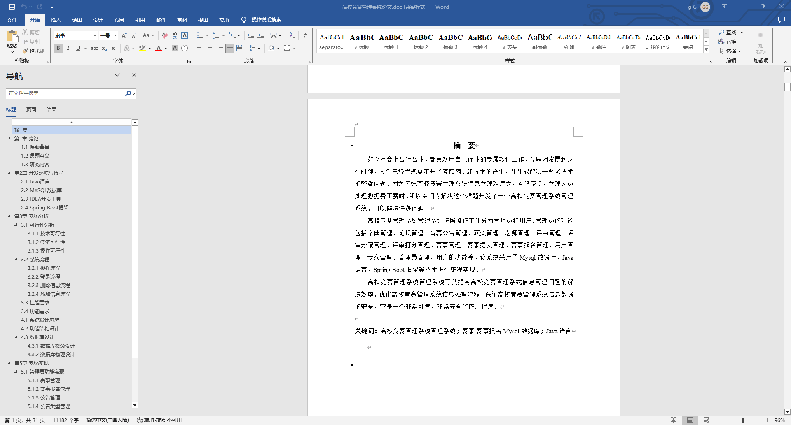
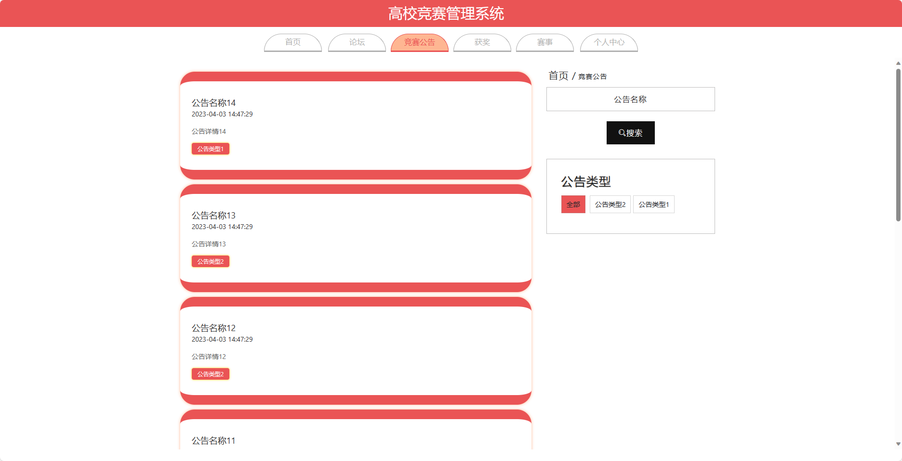
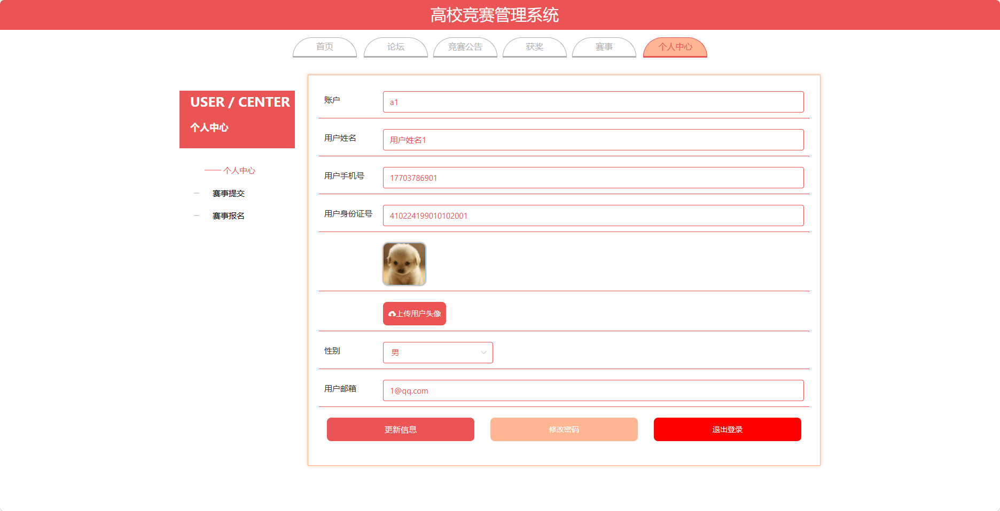
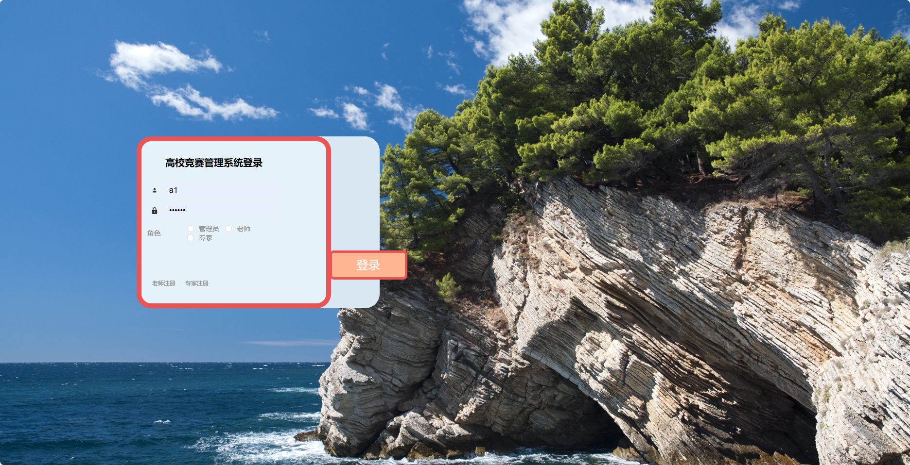
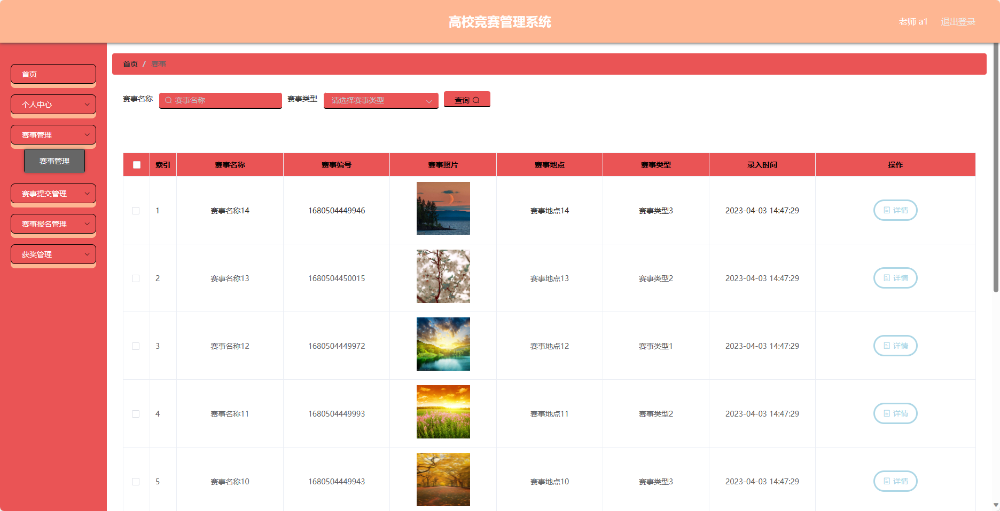
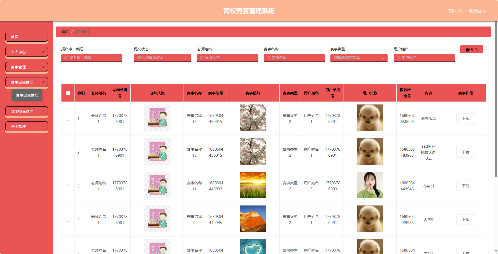
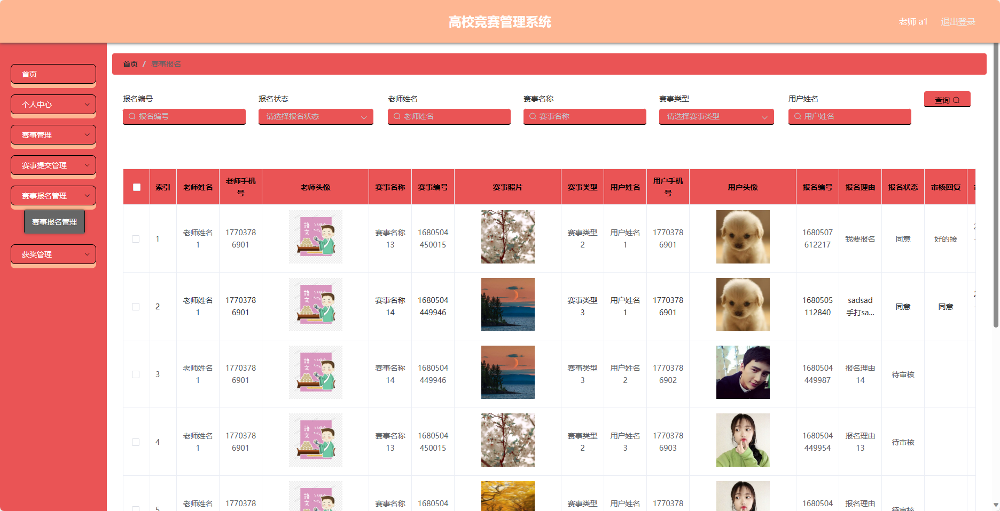

## 基于SpringBoot的高校竞赛管理系统(程序+报告)

###  获取sql数据库文件: 从戎源码网 (https://armycodes.com/) QQ: 386869957 QQ群: 377586148
###  所有系统地址: (https://github.com/YuLin-Coder/AllProjectCatalog) 
###  所有项目以及源代码本人均调试运行无问题 可支持远程安装部署调试、定制修改、代码讲解

## 项目介绍
基于SpringBoot的高校竞赛管理系统，系统包含四种角色：管理员、老师、专家、用户,系统分为前台和后台两大模块，主要功能如下。

### 【管理员】:
- 个人中心：管理个人信息，包括修改密码、查看个人资料等。
- 管理员管理：管理其他管理员的信息，包括添加、编辑、删除管理员账号等操作。
- 用户管理：管理用户的信息，包括添加、编辑、删除用户账号等操作。
- 老师管理：管理老师的信息，包括添加、编辑、删除老师账号等操作。
- 专家管理：管理专家的信息，包括添加、编辑、删除专家账号等操作。
- 评审管理：管理评审的信息，包括添加、编辑、删除评审等操作。
- 赛事管理：管理赛事的信息，包括添加、编辑、删除赛事等操作。
- 竟赛公告管理：管理竞赛公告的发布和编辑等操作。
- 评审分配管理：管理评审分配的信息，包括添加、编辑、删除评审分配等操作。
- 评审打分管理：管理评审打分的信息，包括添加、编辑、删除评审打分等操作。
- 赛事提交管理：管理赛事提交的信息，包括审核、编辑、删除赛事提交等操作。
- 赛事报名管理：管理赛事报名的信息，包括审核、编辑、删除赛事报名等操作。
- 论坛管理：管理论坛的发布和编辑等操作。
- 获奖管理：管理获奖的信息，包括添加、编辑、删除获奖等操作。
- 基础数据管理：管理系统的基础数据，包括轮播图信息的添加、编辑、删除等操作。

### 【用户】:
- 个人中心：管理个人信息，包括修改密码、查看个人资料等。
- 赛事管理：管理赛事的信息，包括添加、编辑、删除赛事等操作。
- 赛事提交管理：管理赛事提交的信息，包括审核、编辑、删除赛事提交等操作。
- 赛事报名管理：管理赛事报名的信息，包括审核、编辑、删除赛事报

专家：
- 个人中心：管理个人信息，包括修改密码、查看个人资料等。
- 评审管理：管理评审的信息，包括添加、编辑、删除评审等操作。
- 赛事管理：管理赛事的信息，包括添加、编辑、删除赛事等操作。
- 评审分配管理：管理评审分配的信息，包括添加、编辑、删除评审分配等操作。
- 评审打分管理：管理评审打分的信息，包括添加、编辑、删除评审打分等操作。
- 获奖管理：管理获奖的信息，包括添加、编辑、删除获奖等操作。

### 【前台】:
1. 首页：展示竞赛相关信息和轮播图信息。
2. 论坛：提供用户之间交流讨论的平台。
3. 竞赛公告：展示竞赛的公告信息。
4. 获奖：展示竞赛获奖者和奖项信息。
5. 赛事：展示竞赛的详细信息，包括赛事规则、报名信息等。
6. 个人中心：用户可以管理个人信息，包括修改密码、查看个人资料等。

## 项目技术
- 编程语言：Java
- 数据库：MySQL
- 项目管理工具：Maven
- 前端技术：HTML、CSS、JavaScript、Jquery、Vue
- 后端技术：Spring、SpringMVC、MyBatis

## 运行环境
- JDK版本：JDK1.8及以上
- 开发工具：IDEA、Ecplise、Myecplise都可以
- 数据库: MySQL5.7及以上
- Maven：maven3.0及以上
- Node：14.14.0及以上

## 运行截图

